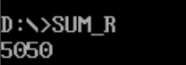
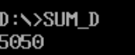
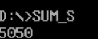

# 第三次作业：求和
## 基本要求
求 1 + 2 + ... + 100, 并将结果 "5050" 打印到屏幕

注意和的结果数据表示范围, 结果的进制转换等问题

1. 尝试结果分别放在寄存器,数据段,栈中等不同位置的操作
2. 完成十进制结果输出(查找21号中断的功能表,找到输入数据的功能调用)

| AH | 功能描述 | 入口参数 | 出口参数 |
|--------|----------|----------|----------|
| 00h | 程序终止（返回 DOS） | CS = 程序段前缀 (PSP) 段地址 | 无 |
| 01h | 键盘输入（带回显，等待输入） | — | AL = 输入字符的 ASCII 码 |
| 02h | 屏幕输出字符 | DL = 待输出字符的 ASCII 码 | — |
| 03h | 串行口输入 | — | AL = 从串行口输入的字符 |
| 04h | 串行口输出 | DL = 待发送到串行口的字符 | — |
| 05h | 打印机输出 | DL = 待打印的字符 | — |
| 06h | 直接控制台 I/O（无回显，不等待） | DL = 0FFh 表示输入，否则为输出字符 | 输入时：AL = 字符（若 ZF=0 有输入，ZF=1 无）；输出时无 |
| 07h | 键盘输入（无回显，等待输入） | — | AL = 输入字符的 ASCII 码 |
| 08h | 键盘输入（无回显，不响应 Ctrl+C） | — | AL = 输入字符的 ASCII 码 |
| 09h | 显示字符串 | DS:DX = 字符串首地址（字符串以 '$' 结尾） | — |
| 0Ah | 输入字符串（带回显，回车结束） | DS:DX = 输入缓冲区首地址（见下方缓冲区结构） | 无（实际长度存于缓冲区第 2 字节） |
| &nbsp; | 缓冲区结构：第1字节=最大长度（含回车）；第2字节=实际输入长度；第3字节起=输入字符 | — | — |
| 0Bh | 检查键盘状态 | — | AL = 00h（无输入）；AL = FFh（有输入） |
| 0Ch | 清除输入缓冲区并调用指定功能 | AL = 要调用的功能号（如 01h/07h/08h 等） | 同指定功能的出口参数 |
| 4Ch | 程序终止并返回退出码 | AL = 退出码（0 表示正常结束） | — |
| 39h | 创建目录 | DS:DX = 目录路径字符串（以 '$' 结尾） | 成功：CF=0；失败：CF=1，AX = 错误码 |
| 3Ah | 删除目录 | DS:DX = 目录路径字符串（以 '$' 结尾） | 成功：CF=0；失败：CF=1，AX = 错误码 |
| 41h | 删除文件 | DS:DX = 文件名（以 '$' 结尾） | 成功：CF=0；失败：CF=1，AX = 错误码 |
| 43h | 获取 / 设置文件属性 | AL=00h（获取）/01h（设置），DS:DX = 文件名 | 成功：CF=0，CX = 文件属性；失败：CF=1 |
| 57h | 获取 / 设置文件修改时间 | AL=00h（获取）/01h（设置），BX = 文件句柄 | 成功：CF=0，CX:DX = 时间；失败：CF=1 |







3. 用C语言实现后查看反汇编代码并加注释

```shell
gcc sum_c.c -o sum_c.exe

gcc -S -masm=intel sum_c.c -o sum_c.ASM
```

