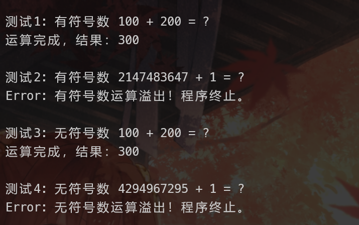
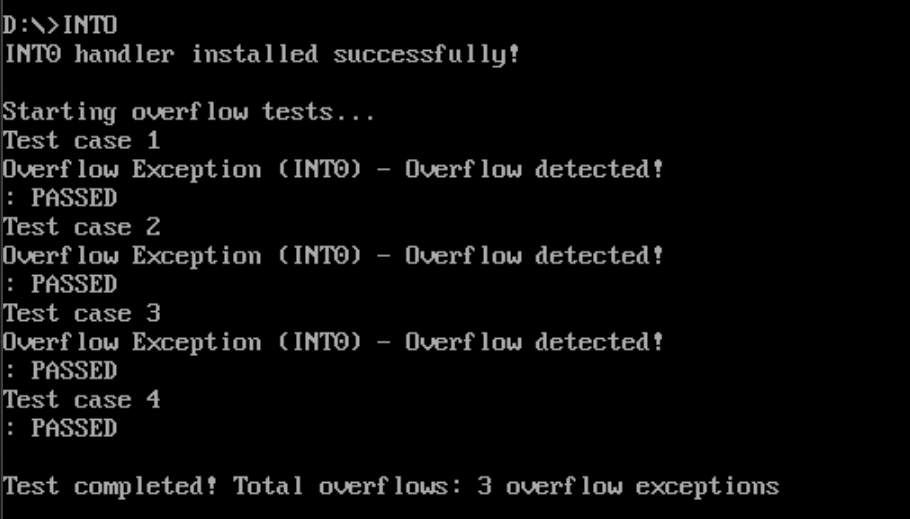

# 作业题目 6：重写溢出中断服务程序
## 背景：
1. 了解标志寄存器
2. 理解一次计算，硬件会同时根据运算结果置进位 / 借位标志 CF（无符号数）和溢出标志OF（有符号数），当 OF 被置 1 表示运算结果错误
3. C 语言对溢出是 NB 行为，程序会有一定风险

### 标志寄存器
- 标志寄存器是 x86 架构 CPU 中的特殊寄存器
  - 本质：一组 “二进制标志位”（每位代表一个状态）
  - 核心作用：记录 CPU 执行指令后的运算结果状态（比如是否溢出、是否进位、结果是否为 0 等），供后续指令（如条件跳转、中断触发）判断逻辑。
  - 标志位由 CPU自动设置：执行算术运算、逻辑运算等指令后，CPU 会根据结果更新对应标志位
  - 部分标志位可手动控制：比如进位标志 CF 可通过CLC（清 0）、STC（置 1）指令手动操作，但溢出标志 OF 只能由 CPU 自动设置；
标志位	名称	含义（核心）	适用场景

| 标志位 | 名称 | 含义（核心） | 适用场景 |
|:---:|:---:|:---:|:---:|
|CF	| 进/借位标志	| 无符号数运算时，结果超出寄存器范围则置 1	| 无符号数加减法|
|OF	| 溢出标志	| 有符号数运算时，结果超出表示范围则置 1	| 有符号数加减法|
|ZF	| 零标志	| 运算结果为 0 则置 1	| 结果是否为 0 判断|

### C 语言对溢出的 “NB 行为”
- C 语言标准并未定义整数溢出的行为，称为 “未定义行为”（Undefined Behavior, UB）
- 风险：
  - 程序可能继续运行，但结果不可预测
  - 不同编译器对溢出的处理方式不同，影响程序的可移植性
- 例子：
```c
#include <stdio.h>
#include <limits.h>
int main() {
    int a = INT_MAX; // 最大整数值
    int b = 1;
    int c = a + b; // 溢出发生
    printf("Result: %d\n", c); // 结果不可预测
    return 0;
}
```

### 为什么内联汇编
- C 语言无法可靠检测有符号数溢出
- 而汇编可以直接访问 CPU 的OF 标志位，或通过INTO中断（当 OF=1 时自动触发 4 号中断）来处理溢出
- 这也是本次作业要求 “重写 INTO 中断服务程序” 的核心原因 —— 用硬件级别的机制保证溢出检测的可靠性。

## 基本要求：
1. C 语言中用内联汇编解决溢出报错
2. 不用 JO(Jump if Overflow) 或 JNO 逻辑
3. 要求重写 INTO（4 号中断）的中断服务程序；目前 INTO 中断服务程序没实际内容，如下图所示：

```plaintext
0070:0008 FE38    ???    [BX+SI]
0070:000A 2C00    SUB     AL,00
0070:000C CF      IRET
```

## C内联汇编具体实现
### 代码实现
#### 代码思路与知识点
- **整体思路**：程序通过四个测试用例演示有符号数和无符号数的溢出检测，避免使用 JO/JNO 跳转指令，而是通过内联汇编直接访问 CPU 标志位，实现可靠的溢出处理。核心是模拟中断服务程序（ISR）的行为，当检测到溢出时调用相应的处理函数。
- **关键知识点**：
  - **内联汇编**：在 C 代码中嵌入汇编指令，允许直接操作 CPU 状态。
  - **溢出检测**：有符号溢出使用 `seto` 指令，无符号进位使用 `setc` 指令，将标志位存储到 C 变量中。
  - **中断模拟**：通过自定义 ISR 函数模拟 INTO 中断的响应，输出错误信息并终止程序。

#### 内联汇编实现
- **语法结构**：使用 `__asm { ... }` 块嵌入汇编代码。汇编指令可以访问 C 变量，如 `mov eax, a` 将 C 变量 `a` 加载到 EAX 寄存器。
- **指令序列**：
  - `mov eax, a`：加载操作数。
  - `add eax, b`：执行加法，自动设置 CF 和 OF。
  - `mov c, eax`：保存结果到 C 变量。
  - `seto overflow` 或 `setc carry`：将标志位存储到字节变量（1 表示溢出/进位，0 表示正常）。
- **避免 JO/JNO**：不使用条件跳转，而是将标志位捕获到变量中，在 C 代码中进行条件判断。

#### 测试场景
程序包含四个独立的测试用例，覆盖有符号和无符号数的正常和溢出情况：
1. **测试1: 有符号数加法，无溢出**  
   计算 100 + 200，结果为 300，OF=0，输出结果。
2. **测试2: 有符号数加法，有溢出**  
   计算 INT_MAX + 1，超出有符号整数范围，OF=1，触发 OverflowISR()。
3. **测试3: 无符号数加法，无溢出**  
   计算 100U + 200U，结果为 300U，CF=0，输出结果。
4. **测试4: 无符号数加法，有溢出**  
   计算 UINT_MAX + 1U，超出无符号整数范围，CF=1，触发 UnsignedOverflowISR()。

#### 模拟中断处理
- **ISR 函数**：`OverflowISR()` 和 `UnsignedOverflowISR()` 模拟中断服务程序，当检测到溢出时输出错误消息并终止程序。
- **中断触发机制**：在 C 代码中检查标志位变量，如果为真，则调用 ISR 函数。这模拟了 INTO 中断（当 OF=1 时自动触发）的行为，但通过软件实现，避免直接修改中断向量。


#### C语言与汇编的交互
- **变量传递**：C 变量直接在汇编中引用，如 `a`、`b`、`c`。汇编指令可以读写这些变量，实现数据交换。
- **标志位捕获**：汇编中的 `seto` 和 `setc` 将 CPU 标志位存储到 C 的 `int` 变量中，C 代码随后检查这些变量进行逻辑判断。
- **混合编程优势**：C 处理高层逻辑（如循环、输出），汇编处理底层硬件操作（如标志位检测），实现高效且可靠的溢出处理。

### 执行结果


## 汇编重写INTO中断服务程序
### 汇编代码实现

#### 相关知识点
- **中断向量表**：x86 系统使用中断向量表存储中断处理程序地址。INT0 对应向量 4，通过 DOS 中断 21h 的 35h 和 25h 子功能获取和设置向量。
- **INTO 指令**：当溢出标志 OF=1 时，INTO 指令触发 INT0 中断，实现硬件级溢出检测。
- **中断处理程序编写**：必须使用 FAR 过程，保存和恢复所有寄存器（包括段寄存器），以 IRET 指令返回。处理程序应简洁，避免复杂操作以减少延迟。
- **段寄存器操作**：不能直接比较段寄存器和立即数，需要先加载到通用寄存器。数据段在中断处理程序中需要重新设置。

#### 代码思路
- **整体设计**：程序采用模块化结构，主程序负责中断向量的安装和恢复，测试函数执行溢出检测，中断处理程序响应 INTO 中断。程序首先保存原中断向量，然后安装自定义处理程序，执行测试，最后恢复原向量，确保系统安全。
- **中断处理机制**：自定义中断处理程序使用 FAR 过程，确保正确处理段间调用。处理程序保存所有寄存器，执行必要操作后恢复现场，避免破坏程序状态。
- **测试策略**：通过执行算术运算故意触发溢出，使用 INTO 指令自动调用中断处理程序。测试函数检查溢出计数器变化来验证中断触发。
- **错误处理**：添加中断向量安装检查，如果失败则显示错误消息并退出，避免程序在无效状态下运行。

#### 测试用例
程序包含四个测试用例，覆盖不同溢出场景：
1. **字节有符号数正溢出**：120 + 50 = 170，超过 127（8位有符号最大值），触发 OF=1。
2. **字有符号数正溢出**：32000 + 5000 = 37000，超过 32767（16位有符号最大值），触发 OF=1。
3. **字节有符号数负溢出**：-120 - 50 = -170，小于 -128（8位有符号最小值），触发 OF=1。
4. **无溢出测试**：100 + 200 = 300，在范围内，OF=0，不触发中断，验证正常情况。

#### 关键指令和流程
- **向量操作**：使用 MOV AX, 3504h / INT 21h 获取向量，MOV AX, 2504h / INT 21h 设置向量。
- **算术运算**：ADD 指令执行加法并设置标志，INTO 检查 OF 并触发中断。
- **计数器管理**：使用 INC 指令增加溢出计数器，通过比较计数器变化验证中断触发。
- **输出处理**：字符串输出使用 MOV AH, 09h / INT 21h，数字输出通过自定义函数实现十进制转换。

