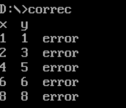
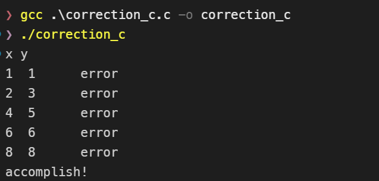

# 作业4 乘法指令和过程调用
## 一、输出九九乘法表
### 基本要求:
- 至少实现一个过程调用, 能正常调用并返回(Call和ret指令)
  - 用Call和ret指令实现过程调用, 过程(process)中需要用到主过程中寄存器资源(掌握寄存器在过程调用前后的保存和恢复)
  - 复习双循环
  - 用C语言实现后查看反汇编并加注释

### 汇编实现
- 整个程序分2 层循环 + 1 个打印过程，流程如下：
  - 外层循环（主程序）：遍历被乘数（1~9），每次调用PRINT_ROW过程打印当前被乘数对应的行；
  - 内层循环（PRINT_ROW过程）：遍历乘数（1~ 当前被乘数），计算被乘数×乘数的结果，格式化为字符串后输出；
  - 过程调用与返回：用CALL调用PRINT_ROW，用RET返回主程序，过程内通过PUSH/POP保存 / 恢复寄存器。


### C语言实现


```shell
# 生成反汇编代码
gcc -S -masm=intel multi.c -o multi_c.asm
```

## 九九乘法表纠错
### 基本要求
- 检查9*9乘法表的结果数据是否正确.将不正确的位置确定下来并显示在屏幕上

eg.
```asm
data segment
table db 7,2,3,4,5,6,7,8,9
      db 2,4,7,8,10,12,14,16,18
      ... (省略部分数据)
data ends
```
则检查结果为:
```text
x  y
1  1  error
2  3  error
```
  - 用Call和ret指令实现过程调用, 过程(process)中需要用到主过程中寄存器资源(掌握寄存器在过程调用前后的保存和恢复)
  - 复习双循环
  - 用C语言实现后查看反汇编并加注释
  - 观察把数据分别定义为全局和局部的区别

### 汇编实现

- 程序流程：
  - 初始化数据段，输出表头。
  - 外层循环：遍历被乘数 x（1~9）。
  - 内层循环：遍历乘数 y（1~9）。
  - 计算正确结果 x*y，使用 `MUL` 指令。
  - 从 `TABLE` 中取值，使用 `CBW` 扩展到 AX。
  - 比较正确值与表值，若不等则输出错误信息：x → 空格 → y → 空格 → "error" → 换行。
  - 使用 `PRINT_NUM` 过程输出数字，通过 `CALL` 和 `RET` 实现过程调用，过程内保存/恢复寄存器。



### C语言实现

